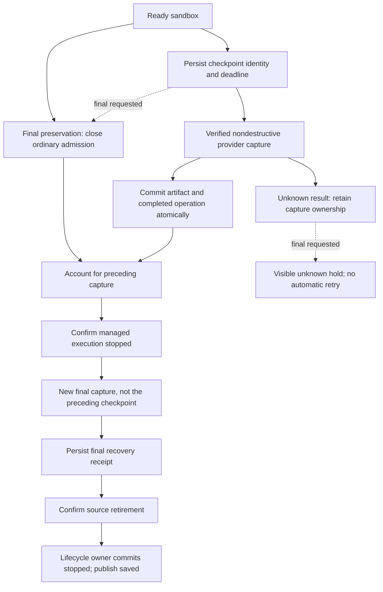

# C2: checkpoint operations without lifecycle overloading

## Scope and dependencies

C2 builds on C1's lifecycle ownership ports and the final-preservation stack (runtime,
control-plane, and web recovery UI). It reuses `SandboxPreservation` and its validated singleton
`sandbox_preservation` record. There is no second coordinator, operation journal, SQL table, or
independently writable admission flag.

The PR is stacked on preservation-web PR #1987 at `2f9d7151a`, including merged C1 (#1989) and the
reviewed runtime/control-plane preservation dependencies (#1985 and #1986). Those preservation
dependencies must land before deploying C2.

## Model

The sandbox remains `ready` throughout an ordinary checkpoint. A checkpoint completion does not
restore a remembered status. A concurrent cancellation, failure, or replacement is never rewritten
to `ready`.

The nested checkpoint record contains a version, operation ID, generation (`sandboxId` and
`createdAt`), provider and object handle, captured runtime version, reason, absolute deadline,
nondestructive guarantee, and capture phase. Completion carries its artifact and timestamp;
uncertainty carries a safe error. Publication validates operation, generation, phase, and source
identity.

## Behavior matrix

| Situation                                                       | Ordinary work and access                                                 | New capture / replacement                             |
| --------------------------------------------------------------- | ------------------------------------------------------------------------ | ----------------------------------------------------- |
| Ready, no capture                                               | Normal policy                                                            | Allowed                                               |
| Nondestructive checkpoint in flight                             | Normal policy; interactive access stays available                        | Serialized behind the checkpoint                      |
| Nondestructive checkpoint result unknown                        | Normal policy while the source remains ready                             | Held; a timeout is not proof remote capture ended     |
| Final preservation waiting/draining/prepared/capturing/retiring | Application admission held, including credential reads and diff commands | Final owner only                                      |
| Final preservation failed/unknown                               | Held                                                                     | Explicit supported recovery only                      |
| Verified saved final receipt                                    | Existing restore admission policy                                        | Restore without silently substituting a fresh sandbox |

Normal prompt, push, and diff commands resolve the same admission-aware socket target. Lifecycle
preparation, stop confirmation, heartbeat, and runtime facts retain their separate raw socket path.
Access checks admission both before and after secret decryption.

### Access boundary

Final ownership withdraws access from the application: it emits an access-change notification,
denies new credential reads, disables the web access hook, and clears/masks cached credentials,
terminal URLs, and tunnel links. Late credential responses cannot repopulate a held view.

This is **not an all-writer freeze**. Previously issued provider credentials, independently opened
connections, detached processes, and arbitrary repository servers are not revoked or stopped by the
application admission gate. Runtime preparation confirms managed agent execution stopped, not that
every possible filesystem writer stopped. Live-capture providers can therefore observe external
writes during capture; writes after capture and before source retirement may be absent from the
saved recovery point. Eventual source retirement does not retroactively include them.

The accepted C2 scope preserves existing provider capture/stop behavior and documents this
limitation. It does not introduce a new capture gate requiring universal execution containment.
Provider/runtime-wide write fencing is a separate enhancement, not a C2 release requirement.

Idle expiry can begin final preservation during an ordinary checkpoint. It closes new work
immediately, waits for capture ownership, and requires a fresh matching preparation and final
capture. An unresolved checkpoint becomes a visible unknown hold instead of authorizing another
provider capture or source destruction. Unresponsive-execution recovery likewise closes admission
before its message stop hold can be cleared.

Waiting has its own durable `waiting_for_checkpoint` phase and deadline. The preparation stop budget
starts only after prior capture ownership settles; all budgets remain bounded by the provider's hard
expiry. Restart or an unresolved capture at the wait deadline produces an unknown hold, not
permission to overlap provider operations.

Heartbeat-stale recovery still permits a nondestructive capture of the existing source under the
same operation owner. Destruction follows only a completed capture; skipped, failed, or unknown
results enter the preservation hold. Preservation claims retirement synchronously for the exact
completed heartbeat operation, generation, and provider object while the outer phase is still
running. If a final request has already acquired ownership, heartbeat recovery does not destroy its
source or detach its socket.

## Outcomes and provider semantics

`CheckpointOutcome` explicitly distinguishes `completed`, `skipped`, `failed`, and `unknown`.
Failure before provider invocation can release the reservation. Once invocation may have occurred,
timeout, thrown errors, and unconfirmed results retain unknown ownership. Late completion cannot
publish after ownership or generation changes. A publication error cannot undo an already committed
receipt.

Ordinary capture requires the provider to explicitly declare `snapshotStopsSandbox: false` (Modal
and OpenComputer adapters). Vercel's destructive snapshot is routed through final preparation and
retirement. Providers without an explicit nondestructive guarantee skip ordinary capture; their
final-preservation protocol remains authoritative. A provider that reports stopping the source
despite its nondestructive declaration closes admission.

These are adapter contracts, not evidence of live-provider canary results.

## Legacy and rollout behavior

- No production path writes `snapshotting`; the status remains readable for compatibility. Legacy
  `snapshotting` rows or `checkpointInFlight: true` are converted to an unknown hold, never inferred
  ready or saved.
- A legacy live generation without a preservation record may continue ordinary work, but skips
  unowned checkpoint calls. When retirement is requested it enters an explicit unknown hold instead
  of destroying a source whose final capture was skipped. Without verified recovery evidence, use a
  separate session or operator recovery; do not clear the hold automatically.
- Malformed, unsupported-version, or inconsistent operation metadata fails closed in the repository
  decoder. Missing and malformed state are distinct.
- Keep the preservation runtime rebuild floor at 71 and the independent snapshot compatibility floor
  unchanged (62). Upgrade compatible runtime images before enabling this control-plane behavior.
- Before cutover, inventory legacy in-flight snapshots, active provider captures, legacy live
  generations, and unknown outcomes. Complete verified live captures or retain explicit holds; do
  not translate uncertainty into readiness.
- Use a controlled cutover. Old preservation readers strip unknown JSON fields; mixed-version
  writers can erase checkpoint ownership. Do not roll back to an operation-unaware binary while
  active/unknown ownership or admission holds exist. A rollback binary must retain this decoder and
  admission contract until those records are safely resolved.
- Provider canaries remain a release gate: Modal/OpenComputer concurrent work and capture; Vercel
  stop-on-snapshot; Daytona/E2B retained-state preservation; idle drain during checkpoint;
  interrupted capture; source retirement and restore. This implementation does not deploy or run
  paid live-provider operations.

## Verification

Focused tests cover durable decoder round trips and rejection, concurrent ordinary work, duplicate
capture, runtime provenance, cancellation and generation/object/ operation replacement, absolute
deadlines, restart, late completion, alarm await races, checkpoint-versus-final separation,
capability mismatch, and legacy holds. Real Workerd tests verify the composed command/access gates
and persisted restart and legacy behavior. Manager tests keep lifecycle transitions behind its
ports.

Full unit and Workerd suites, all control-plane typecheck configurations, Worker and Node builds,
lint and actual ESLint boundary tests are required before handoff. Live-provider validation is
separate from these deterministic checks.

### Original implementation validation

- Control-plane unit: **4,912 passed** across 307 files.
- Full Workerd integration: **1,311 passed, one skipped** across 110 files. Additional focused
  reruns cover the final checkpoint/stop-timeout wiring (five preservation tests).
- Shared package: **921 passed** across 57 files.
- Preservation runtime (bridge, Claude and OpenCode harness): **21 passed**.
- Modal snapshot-deadline tests: **6 passed**.
- Control-plane Worker, Node, unit-test and integration typechecks passed.
- Worker and Node builds, control-plane lint, formatting, and both actual ESLint-boundary tests
  passed.
- Independent architecture/race review: **Approve** after regression probes and fixes for stale
  alarm reads, absolute deadlines, legacy retirement, and stop-confirmation recovery admission;
  final small-delta review also approved.

The simplicity pass kept the outcome type in the existing lifecycle ports and removed the old
checkpoint boolean/generation pair and prior-status restoration. No generic operation framework or
additional coordinator was introduced.

### PR preparation validation

After replaying C2 on the latest preservation stack, the only conflict was its storage-port name. C2
now narrows the existing `SandboxPreservationStorage` port instead of adding a duplicate checkpoint
port; lifecycle status writes remain behind the manager-owned completion callback.

- Full control-plane unit suite: **4,916 passed** across 307 files.
- Focused Workerd preservation, early-connect, snapshot/access, and collaborator-wiring suites: **20
  passed** across four files.
- Runtime preservation suites: **48 passed**.
- All control-plane typecheck configurations, Worker/Node builds, lint, and both ESLint-boundary
  tests passed. The full Workerd result above describes the original implementation baseline; this
  revalidation uses the focused suites on the updated dependency stack.
- Repository CI targets PRs into `main`; retarget and require its checks after the preservation
  stack merges. Stacking does not waive runtime-image and live-provider rollout gates.

### Review-feedback validation

The feedback changes add a distinct checkpoint-wait budget, preservation-owned heartbeat retirement,
UI credential withdrawal, typed/split tests, and retryable pre-provider failures. The access
boundary above records the accepted scope without a new provider capture gate.

- Full control-plane unit suite: **4,929 passed** across 308 files.
- Full Workerd integration suite: **1,312 passed, one skipped** across 110 files.
- Full web unit suite: **1,787 passed** across 206 files.
- Full shared unit suite: **939 passed** across 57 files.
- All control-plane typecheck configurations and web typecheck passed.
- Worker/Node builds, control-plane lint, focused web lint, formatting of changed files, and both
  actual ESLint sandbox-boundary tests passed.
- New regressions cover checkpoint completion after the original stop window, restart/hard expiry,
  persisted wait metadata, heartbeat/final ownership races, cached and late credential responses,
  initial/reconnect access holds, and retry versus unknown classification around provider
  invocation.

No live-provider canary or deployment was performed. The earlier independent review predates these
feedback changes; this validation does not claim a new independent approval.
